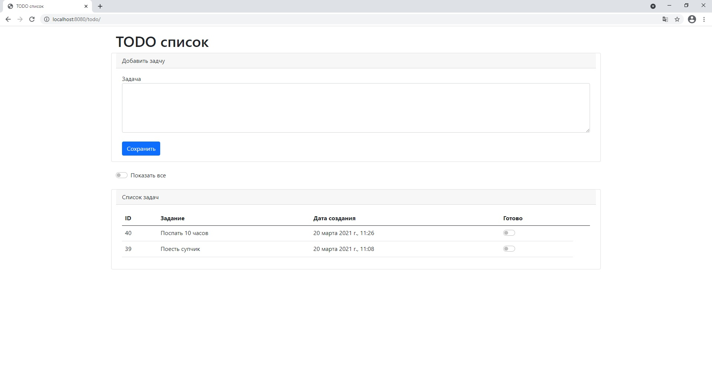
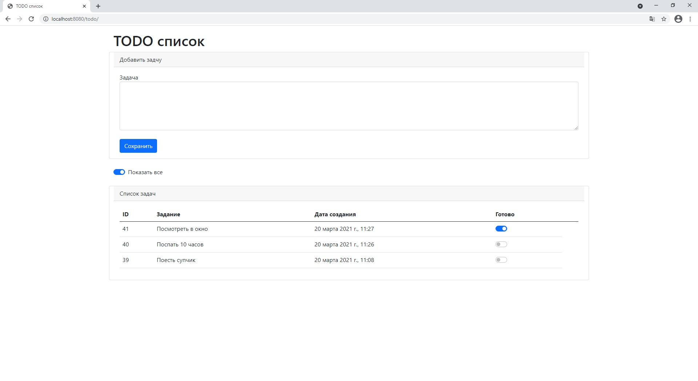
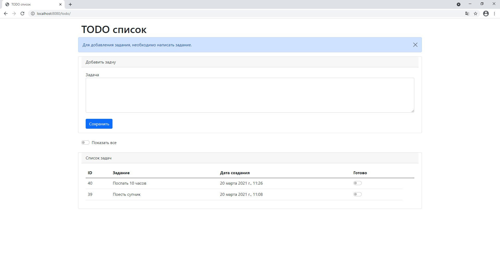

# job4j_todo
Приложение "TODO список". 

Приложение имеет: 
- страница со списком дел index.html
- переключатель для указания статуса выполнения задачи
- фильтр <b>"Показать все"</b>, который добавлет в список выполненные задачи.
- проверка попытки добавления пустой задачи

